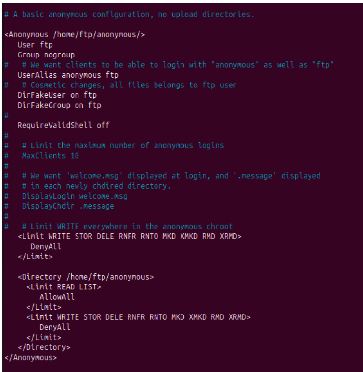
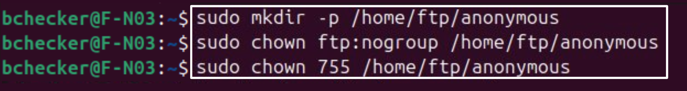
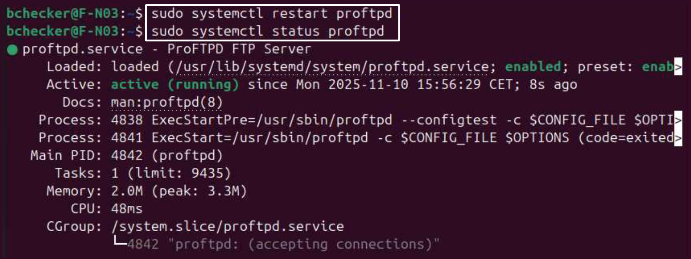
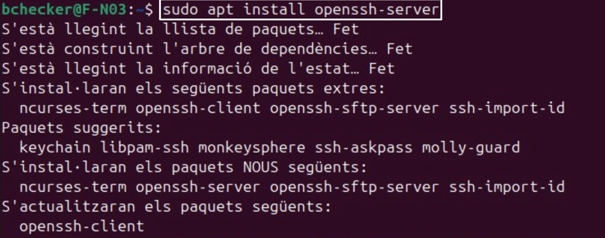

# *3. FTP*

## Configuración:
Antes de realizar cualquier cambio, verifico la identidad del sistema mediante:

```bash
ip a
```

La interfaz enp1s0 muestra la dirección IP 192.168.26.15/24, lo que confirma que estoy en el servidor F-N03, dedicado exclusivamente a servicios de transferencia de archivos.

### Instalación del servidor FTP

Se instala el paquete proftpd:
```bash
sudo apt install proftpd
```

Durante la instalación, se selecciona el modo standalone.

### Configuración de acceso anónimo seguro

Se edita el archivo /etc/proftpd/proftpd.conf para configurar un entorno anónimo de solo lectura:
```bash
sudo nano /etc/proftpd/proftpd.conf
```


```bash
<Anonymous /home/ftp/anonymous>
  User ftp
  Group nogroup
  UserAlias anonymous ftp
  DirFakeUser on ftp
  DirFakeGroup on ftp
  <Limit WRITE STOR DELE RNFR RNTO MKD RMD>
    DenyAll
  </Limit>
</Anonymous>
```



Se crea y prepara el directorio raíz del servicio:
```bash
sudo mkdir -p /home/ftp/anonymous
sudo chown ftp:nogroup /home/ftp/anonymous
sudo chmod 755 /home/ftp/anonymous
 ```



Luego, se reinicia el servicio y se verifica que siga en funcionamiento: 
```bash
sudo systemctl restart proftpd
```



Comprobamos que un usuario no pueda subir ningún archivo

### Instalación de OpenSSH.
Además, se instala SSH para administración remota segura:
```bash
sudo apt install openssh-server
```


