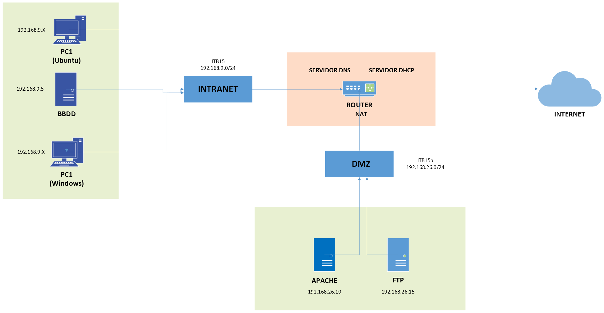
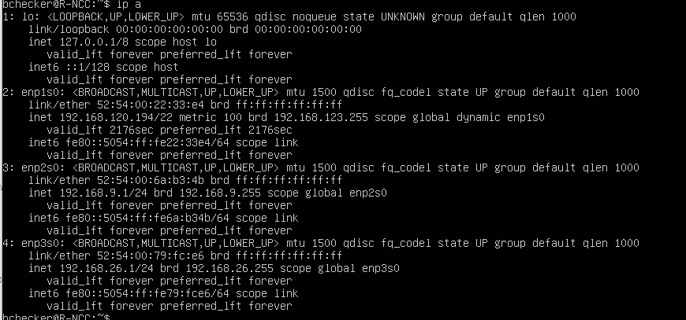
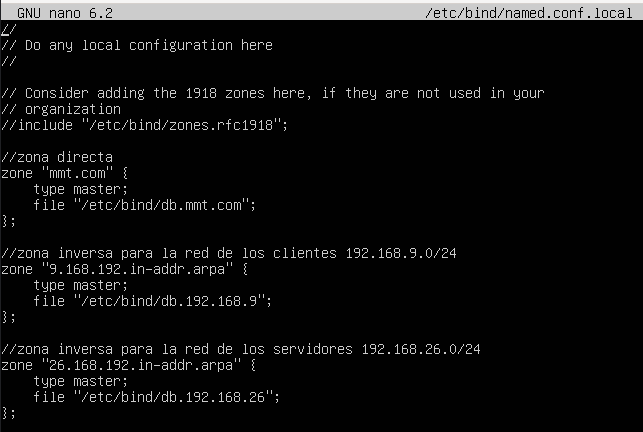
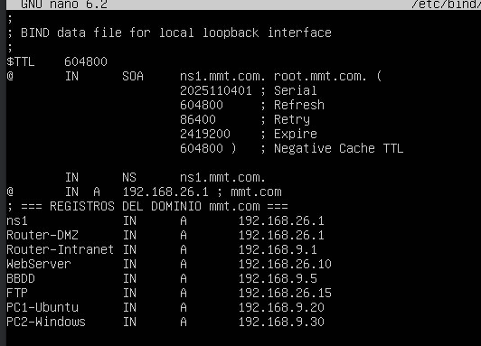
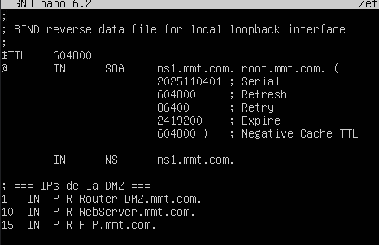
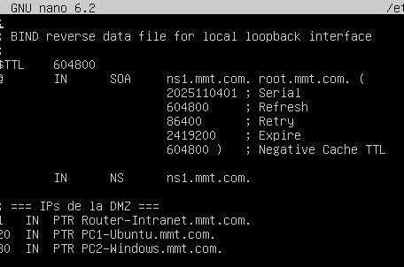
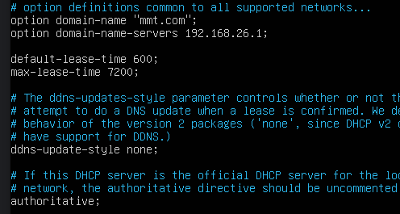
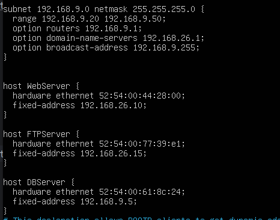

# G3_ManuelReyes-MiguelValencia-TrishanMizhquiri


1. Topologia
2. Máquinas
   - ROUTER
   - BBDD
   - FTP
   - Web SRV
4. Clientes
   - PC1 - Ubuntu
   - PC2 - Windows

6. Comprobaciones
   - Servidor
   - FTP
   - Web
   - DNS
   - DHCP
   - Base de datos

8. ProofHub


## 1. Topologia



### Esquema de Red

| Dispositivo / Servidor | Dirección IP  |
| :--------------------- | :-----------  |
| **Router / DNS / DHCP**| 192.168.9.1   |
|                        | 192.168.26.1  |
| **BBDD**               | 192.168.9.5   |
| **Web SRV**            | 192.168.26.10 |
| **FTP**                | 192.168.26.15 |
| **PC1 - Ubuntu**       | 192.168.9.25  |
| **PC2 - Windows**      | 192.168.9.30  |

## 2. Maquinas

### 1. Router
S'ha desplegat una infraestructura de xarxa multicapa, dissenyada per allotjar serveis web i de dades. La topologia es divideix en tres zones de xarxa diferents, gestionades per un router central (`R-N03`), per aïllar els serveis i controlar el flux de trànsit:

-   **Router Central (R-NCC):** Actua com a nucli de la xarxa, gestionant l'encaminament, el tallafocs i els serveis essencials de xarxa (DHCP i DNS).
-   **Xarxa Intranet (`192.168.9.0/24`):** És la xarxa interna i segura. Allotja les estacions de treball dels clients (`PC1-Ubuntu`, `PC2-Windows`) i el servidor de la base de dades (`B-N03`) per protegir-lo de l'accés directe.
-   **Xarxa DMZ (Zona Desmilitaritzada) (`192.168.26.0/24`):** És una xarxa perimetral dissenyada per allotjar els serveis que necessiten ser accessibles des d'altres xarxes, com el Servidor Web (`W-N03`) i el Servidor FTP (`F-N03`).
-   **Connexió WAN (NAT):** El router proporciona sortida a Internet a les màquines de la Intranet i la DMZ mitjançant Traducció d'Adreces de Xarxa (NAT), permetent actualitzacions de programari mentre es protegeixen les adreces IP internes.

Aquest són els adaptadors que tenim:

enp1s0: NAT

enp2s0: intranet

enp3s0: DMZ

#### Configuració de xarxa:

Per començar, configurem la nostra xarxa, la enp1s0 ens donarà sortida a internet, el enp2s0 és on estarà la intranet, és on es conectaran els nostres clients. També posarem la BBDD, després a la DMZ, els serveis que ens interessa que estiguin exposats a internet, FTP i el servidor web. 
```bash
sudo cat /etc/netplan/00-installer-config.yaml
```


-   **Interfície WAN (`enp1s0`):** S'ha configurat amb `dhcp4: true` perquè obtingui la seva adreça IP de la xarxa externa.
-   **Interfícies Internes (`enp2s0`, `enp3s0`):** S'han configurat amb adreces IP **estàtiques**. Això és **crític i obligatori**. Aquestes adreces són les portes d'enllaç (`gateway`) per a les seves respectives xarxes. Han de ser fixes i predictibles perquè els clients i servidors sàpiguen sempre a qui enviar el trànsit destinat a altres xarxes.

apliquem la configuració:

```bash
sudo netplan apply
```
Verificació:



Configuració IP Forwarding:

Per continuar, hem d'habilitar el reenvio d'IP, això permet que el tràfic passi a través del router i que actuï com a router.

```bash
sudo nano /etc/sysctl.conf
```


apliquem el canvi:
```bash
sudo systctl -p
```

Iptables NAT:

El servei `iptables` del nucli de Linux s'utilitza per controlar tot el trànsit que flueix a través del router, actuant com a tallafocs principal i motor de NAT.
```bash
sudo iptables -t nat -A POSTROUTING -O enp1s0 -j MASQUERADE
sudo iptables -t nat -L -v -n
```


La taula `nat` s'encarrega de proporcionar accés a Internet a les dues xarxes internes. Mitjançant una única regla `MASQUERADE` a la cadena `POSTROUTING`, el router tradueix dinàmicament les adreces IP privades a la seva pròpia adreça pública de la interfície WAN. Aquesta configuració permet que tots els equips interns naveguin i rebin actualitzacions de forma segura, ocultant l'estructura de la xarxa interna de l'exterior i optimitzant l'ús d'adreces IP.
```bash
sudo iptables -A FORWARD -i enp2s0 -o enp3s0 -j ACCEPT
sudo iptables -A FORWARD -i enp2s0 -o enp2s0 -m state --state RELATED,ESTABLISHED -j ACCEPT
sudo /usr/sbin/netfilter-persistent save
```


A més d'aquestes comandes, si anem a /etc/iptables/rules.v4 veurem la configuració completa on controlem el transit i accesos a les xarxes. 


La taula `filter` gestiona el flux de trànsit entre les interfícies: permet la comunicació des de la Intranet cap a la DMZ i Internet, però bloqueja per defecte les connexions iniciades en sentit invers. La regla més crítica implementa el principi de mínim privilegi, creant una excepció altament específica que permet al Servidor Web comunicar-se amb la Base de Dades a través del port de MySQL. 


#### Configuració DNS:
instal·lació del bind9 per la configuració del DNS.

```bash
sudo apt-get install bind9 bind9utils bind9-doc
```


Comprovem que el servei funciona.

```bash
sudo systemctl status named.service
```


Configurarem una zona directa y dues zones inverses, l’idea es que resolgui amb el nom de domini mmt.com

```bash
sudo nano /etc/bind/named.conf.local
```



Zona directa:

```bash
sudo cp /etc/bind/db.local /etc/bind/db.mmt.com
```




Zona inversa:
Aqui tenim la primera zona inversa, correspont a la DMZ. 
```bash
sudo cp /etc/bind/db.local /etc/bind/db.192.168.26
```
```bash
sudo nano /etc/bind/db.192.168.26
```




Segona zona inversa, aquesta es la intranet. 

```bash
sudo nano /etc/bind/db.192.168.9
```


Un cop configurat, podem verificar la sintaxis i que tot estigui correcte amb:
```bash
sudo named-checkzone 26.168.192.in-addr.arpa /etc/bind/db.192.168.26
```


#### *Configuració DHCP:*
Instalació DHCP

```bash
sudo apt-get install isc-dhcp-server
```


Configurem els rangs que li donarem a cada xarxa. Els dividim en dos, pero hem de tenir en compte que tant la Base de dades, com el servei web y també el FTP es mantindran fixes. 
l'arxiu de configuració es el seguent: 

```bash
/etc/dhcp/dhcpd.conf
```



El posem en marxa, ara els ordinadors clients rebran ips i sortiran a internet.

```bash
sudo systemctl restart isc-dhcp-server
sudo systemctl enable isc-dhcp-server
sudo systemctl status isc-dhcp-server
```


### *2. BBDD*

La Base de dades es desplegarà en el servidor amb l'adreça IP **192.168.9.5/24**.
La connectivitat a Internet es proporcionara a través d'una màquina router. Aquesta conexió externa està configurada mitjançant **DHCP**, de manera que l'adreça IP publica ( o de sortida) es gestiona de forma dinàmica pel router.

#### Configuración:

```bash
ip a
ping 192.168.9.1
```


Instalación de base de datos mysql

```bash
sudo apt install mysql-server
```


```bash
sudo mysql -u root -p
```

Ingrese a la base de datos y cree el usuario root para que cualquiera que esté con la ip 192.168.26.% pueda acceder a la base de datos


Le doy privilegios


Modifico el fitxero mysqld.cnf 

```bash
sudo nano /etc/mysql/mysql.conf.d/mysqld.cnf
```


Reiniciamos el mysql

```bash
sudo systemctl restart mysql
```


### *3. FTP*
El servidor FTP (192.168.26.15) que se ubica en la DMZ cumple la función de ser el punto de intercambio y gestión de archivos para los servidores de la zona.
Permite al webmng actualizar los archivos del servidor web, almacena los logs, backups y archivos multimedia. Como esta disponible desde el router, se puede acceder a su contenido sin comprometer la red interna (192.168.9.x).
En cuanto a sus funcionalidades de seguridad, separa el servicio de transferencia de archivos del servidor web. Si algún atacante intenta el FTP, el atacante no obtendrá acceso sidrecto ni a la web ni a la BBDD. 

#### Configuración:


Instalamos FTP

```bash
sudo apt install proftpd
```


### *4. Web SRV*

El servidor web (192.168.26.10) es la pieza central del proyecto, su funcion principal es alojar la web y servir la pagina a los usuarios y clientes. Dspués de que el router dirija a los usuarios que buscan la pagina en internet a 192.168.26.10, el servidor apache recive la petición. Este procesa contenido estàtico (el index.html y el style.css) y contenido dináimco (el get_data.php) que es un sript que al ejecutarse muestra los datos de la BBDD. Una vez procesado, entregal lla respuesta al router.

#### Configuración:
Instalamos apache2

```bash
sudo apt-get install apache2
```


Comprobamos que el servicio esté activo i escuchando el puerto 80

```bash
sudo systemctl status apache2.service
sudo lsof -i :80
```


Modificamos el archivo index.html para que muestre la web que deseamos

```bash
sudo nano /var/www/html/index.html
```


Creamos el archivo style.css para que se vea como queremos

```bash
sudo touch /var/www/html/style.css
sudo nano /var/www/html/style.css
```


Creamos el script get_data.php para recoger los datos del servidor de BBDD

```bash
sudo touch /var/www/html/get_data.php
sudo nano /var/www/html/get_data.php
```


Instalamos ssh

```bash
sudo apt-get install openssh-service
sudo systemctl status ssh.service
```


Solo queda resetear los servicios para aplicar los cambios:

```bash
sudo systemctl restart apache2.service
sudo systemctl status apache2.service
```


Y comprobar la conectividad desde los clientes


### *5. Clientes*

#### a. PC1 - Ubuntu
Actualizamos las librerias del apt-get y del apt

```bash
sudo apt-get update
sudo apt update
```


Instalamos el ssh

```bash
sudo apt-get install openssh-server
sudo systemctl status ssh.service
```


#### a. PC2 - Windows


