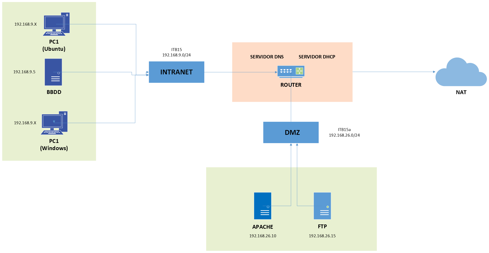

# G3_ManuelReyes-MiguelValencia-TrishanMizhquiri

1. Topologia
2. Máquinas
   - ROUTER
   - BBDD
   - FTP
   - Web SRV
4. Clientes
   - PC1 - Ubuntu
   - PC2 - Windows

6. Comprobaciones
   - Servidor
   - FTP
   - Web
   - DNS
   - DHCP
   - Base de datos

8. ProofHub

## 1.Topologia

### Esquema de Red

| Dispositivo / Servidor | Dirección IP  |
| :--------------------- | :-----------  |
| **Router / DNS / DHCP**| 192.168.9.1   |
|                        | 192.168.26.1  |
| **BBDD**               | 192.168.9.5   |
| **Web SRV**            | 192.168.26.10 |
| **FTP**                | 192.168.26.15 |
| **PC1 - Ubuntu**       | 192.168.9.25  |
| **PC2 - Windows**      | 192.168.9.30  |

## 2. Maquinas

### *1. Router*

El routes se encarga de 

### *2. BBDD*

La Base de dades es desplegarà en el servidor amb l'adreça IP **192.168.9.5/24**.
La connectivitat a Internet es proporcionara a través d'una màquina router. Aquesta conexió externa està configurada mitjançant **DHCP**, de manera que l'adreça IP publica ( o de sortida) es gestiona de forma dinàmica pel router.

